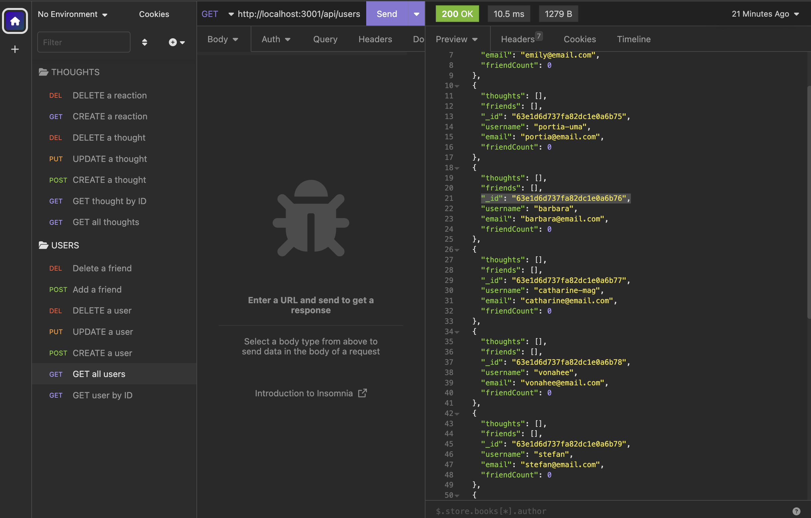

# Social Network API
 

## Description
This application uses Express.js for routing, a MongoDB database, and the Mongoose ODM to create a social network web application API where users can share their thoughts, react to friends' thoughts, and create a friends list.

## Table of Contents
- [Installation](#installation)
- [Usage](#usage)
- [Credits](#credits)
- [License](#license)
- [Contributing](#contributing)
- [Tests](#tests)
- [Questions](#questions)

## Installation
To install, first install the necessary packages by running npm i, then seed the data by running node utils/seed.js and finally spin up the server by running npm start.

## Usage
To test the API, use a REST client such as Insomnia or Postman and follow the routes outlined in the routes folder.

## Credits
Collaborators: Amaryah Wolf

## License
This application is covered under the MIT license.

## Contributing
[Contributor Covenant](https://www.contributor-covenant.org/version/2/1/code_of_conduct/)

## Tests
N/A

## Questions
For additional questions, find me on [github](https://github.com/amaryahwolf) or email me at amaryahwolf@gmail.com.